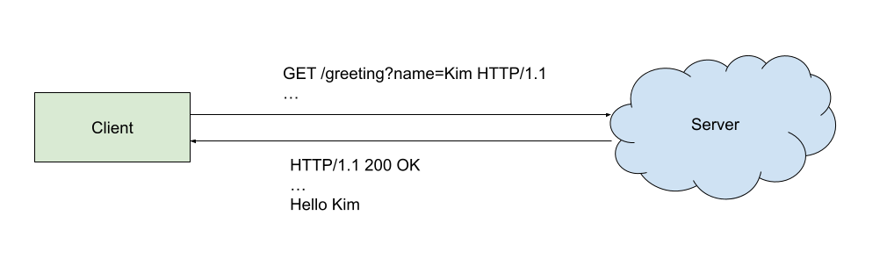

# Logic, dependency injection, MVCS

----

## Where are we at?

* We want to build URL shorter service (class 1)
* We know how to build simple Spring Boot application (class 2)

----

## Agenda for today
* We will make a first implementation of our service (MVP)
* We will use dependency injection to reduce the boilerplate
* We will apply MVCS patter to organise our code

----

## Core functionality

* As a link creator I would like to create a short link for my long URL
* As a link user I would like to be redirected to the original URL by following a short link 

Read more about [user stories](https://en.wikipedia.org/wiki/User_story).

----

## HTTP



4 main verbs:
* GET – obtain resource from the server
* POST – create a new resource on the server
* PUT – update resource on the server
* DELETE – delete resource from the server

----

### Curl

Command line HTTP client.

To send GET request:
```
curl http://localhost:8080/greeting
```

----

## Philips HUE Live Demo

Get info about my lamp:
```
curl http://192.168.0.189/api/DKOQwxk5PN0BE5ZVBcANlnXFLXdk-uR8KGNzEup4/lights/11
```

Update my lamp state
```
curl -X PUT http://192.168.0.189/api/DKOQwxk5PN0BE5ZVBcANlnXFLXdk-uR8KGNzEup4/lights/11/state --data '{"on": true}'
```
---

## Simple API

### Create short link
```
curl -X POST http://localhost:8080/links --data '{"url": "http://example.org"}'
```

Response:
```
{ "url": "http://localhost:8080/xxx" }
```

----

### Expand short link
```
curl http://localhost:8080/xxx -v
```

Response:
```
< HTTP/1.1 301 
< Location: http://example.com
```

----

## Add a controller

```java
package com.redi.demo.controller;

import com.redi.demo.model.CreateShortLinkRequest;
import com.redi.demo.model.ShortLink;
import java.net.URI;
import java.util.Map;
import java.util.concurrent.ConcurrentHashMap;
import javax.servlet.http.HttpServletResponse;
import org.springframework.http.HttpHeaders;
import org.springframework.http.HttpStatus;
import org.springframework.web.bind.annotation.GetMapping;
import org.springframework.web.bind.annotation.PathVariable;
import org.springframework.web.bind.annotation.PostMapping;
import org.springframework.web.bind.annotation.RequestBody;
import org.springframework.web.bind.annotation.RestController;

@RestController
public class ShortLinksController {
  private final String BASE_URL = "http://localhost:8080";
  private Map<String, URI> shortLinks = new ConcurrentHashMap<>();

  @PostMapping("links")
  public ShortLink createLink(final @RequestBody CreateShortLinkRequest request) {
    final var key = generateKey();
    shortLinks.put(key, request.originalURL);
    final var uri = URI.create(String.format("%s/%s", BASE_URL, key));
    return new ShortLink(uri);
  }

  @GetMapping("/{key}")
  public void expandLink(
      final @PathVariable(value = "key") String key,
      final HttpServletResponse httpServletResponse) {
    httpServletResponse.setStatus(HttpStatus.MOVED_PERMANENTLY.value());
    httpServletResponse.setHeader(HttpHeaders.LOCATION, shortLinks.get(key).toString());
  }

  private String generateKey() {
    return "TODO";
  }
}
```

----

## Add model

```java
package com.redi.demo.model;

import com.fasterxml.jackson.annotation.JsonCreator;
import com.fasterxml.jackson.annotation.JsonProperty;
import java.net.URI;

public class CreateShortLinkRequest {
  public final URI originalURL;

  @JsonCreator
  public CreateShortLinkRequest(@JsonProperty("url") final URI originalURL) {
    this.originalURL = originalURL;
  }
}
```

----

```java
package com.redi.demo.model;

import java.net.URI;

public class ShortLink {
  public final URI url;

  public ShortLink(final URI url) {
    this.url = url;
  }
}
```

---